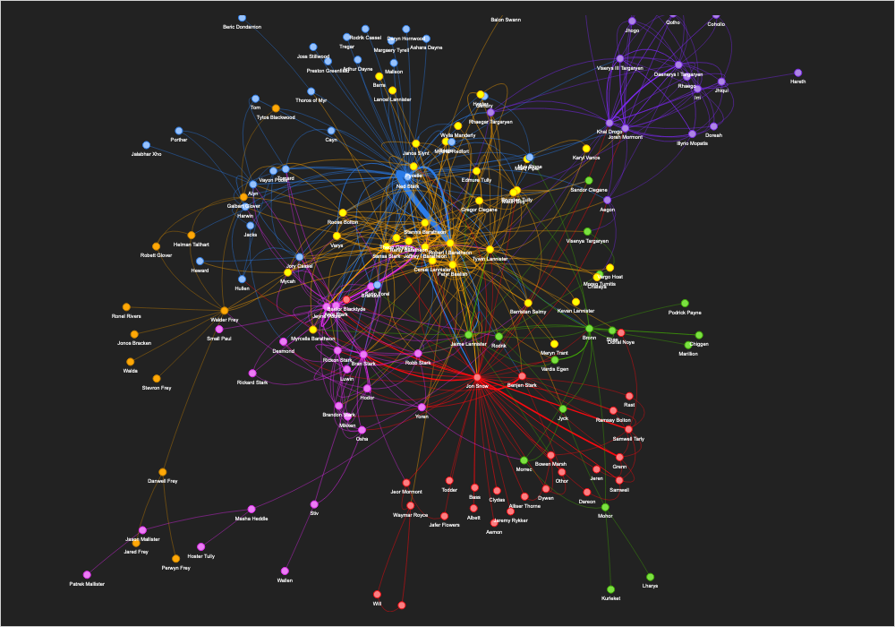

# Exploring the Social Dynamics of 'A Song of Ice and Fire' Through Network Analysis



## Introduction

This project uses web scraping, data visualization, natural language processing, and network analysis techniques to gain insights into the complex world of George R. R. Martin's 'A Song of Ice and Fire' book series. The project focuses on the relationships between the characters of the series, how they change and evolve throughout the books.

## Data Collection

The character data used in this project was collected by web scraping the A Song of Ice and Fire Wiki website (https://iceandfire.fandom.com/wiki/Wiki) using selenium library. The script collects character's name, houses, aliases, culture, and books they appeared in.

## Data Analysis

The project involves several key steps:

1. Using Spacy to perform Named Entity Recognition (NER) on the text to identify characters. NER is a technique used in NLP to identify and classify named entities in text, such as people, places, and organizations. In this project, I've used Spacy to identify the characters in the text.
3. Filtering the data using Pandas. After extracting the characters, I've used Pandas to filter the data and prepare it for analysis.
4. Creating relationship pairs and calculating how many times they appear in the text together. One of the key insights that can be gained from analyzing characters in a book series is understanding the relationships between them. In this project, I've used the extracted character data to create pairs of characters who appear together in the text and calculated how many times they appear together.
5. Using NetworkX to create a graph of characters, with each character represented by a node. NetworkX is a Python library for the creation, manipulation, and study of the structure, dynamics, and functions of complex networks. In this project, I've used NetworkX to create a graph of the characters in the "Song of Ice and Fire" series, with each character represented by a node.
6. Calculating the degree centrality of each node in the graph to identify the most important characters. Degree centrality is a measure of the importance of a node in a graph based on the number of its immediate neighbors. In this project, I've calculated the degree centrality of each node in the character graph to identify the most important characters in the series.
7. Plotting the evolution of character importance through the books. One of the key questions that can be answered by analyzing the character data is how the importance of different characters changes over the course of the series. In this project, I've plotted the evolution of character importance through the books to show how the characters' roles in the story change over time.

## Visualization

The results of the data analysis are presented through interactive plots and network visualizations using pyvis. These visualizations provide a deeper understanding of the interactions and power dynamics between the characters of the series. To see interactive visualizations,  open `got.html` file. 

## How to Use

The project is developed in Python 3.10.6 with Jupyter Notebook, to use the project you will need to have the following libraries installed:

* pytest
* pylint
* ipdb
* jupyterlab
* numpy
* pandas
* matplotlib
* seaborn
* selenium
* webdriver-manager
* spacy
* networkx
* pyvis
* communty

You can install them using pip:

```pip install -r requirements.txt```

To run the project, open the Jupyter notebook `exploring_social_dynamics.ipynb` and run the cells in order.

## Conclusion

This project demonstrates how network analysis and data visualization can be used to gain a deeper understanding of the relationships between the characters in George R. R. Martin's "A Song of Ice and Fire" book series. It provides an interactive way for fans of the series to explore the complex dynamics of the world and characters, and can also be used as a teaching tool for students learning about network analysis and data visualization.

## Limitations

The project is limited by the data available on A Song of Ice and Fire Wiki and the structure of the Wiki itself, the characters are represented by pages and the interactions are represented by the links between them. However, this project can be further expanded by using more sources of data, like the books and the series and extract more information about characters' traits, events and dynamics.

## Future Work

This project can be extended to look at other aspects of the series, such as the dynamics of the different houses. Additionally, it could be used as a starting point for further research on how network analysis and data visualization can be used to study fictional worlds and characters.

